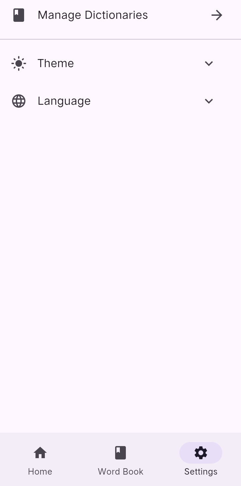
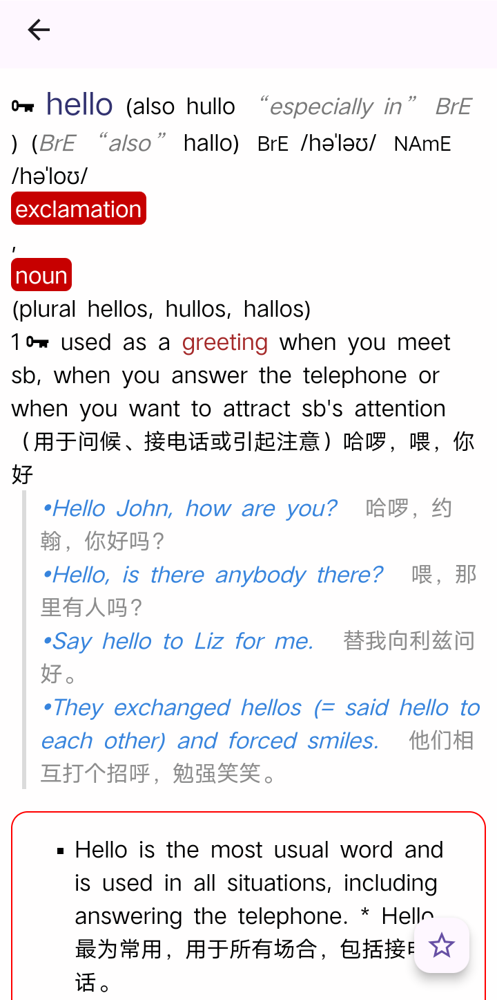
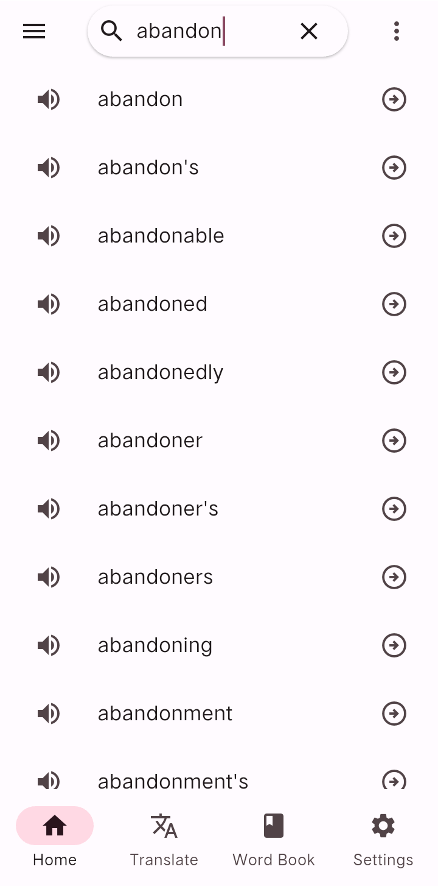
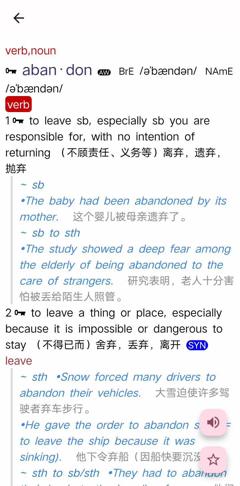
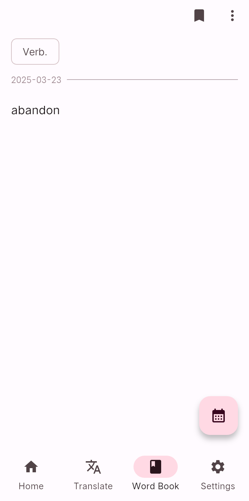
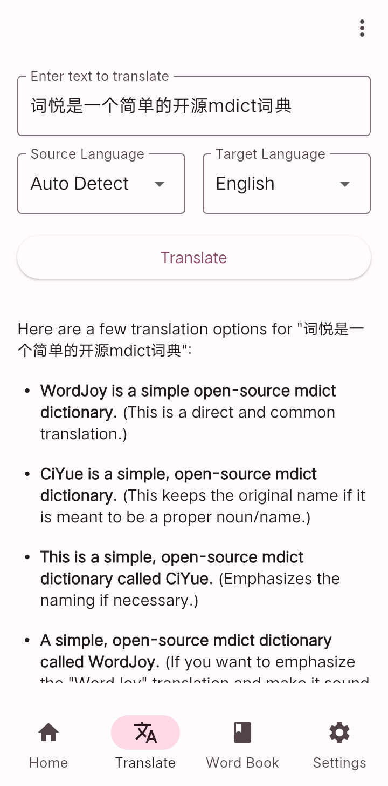

# 词悦

[English](./README.md) | 中文

支持 Android/Windows/Linux 的 mdict 词典。

## 特点
* 📄 支持 MDX/MDD (Linux 暂不支持)
* 🔍 支持多词典搜索和显示
* 🎨 支持 Material You
* 🌐 AI 翻译 (支持 OpenAI, Gemini, Deepseek...)
* 🔈 支持朗读
* 🔖 收藏单词到单词本

## 截图

|  |  |  |  |
|-|-|-|-|
|  |  |  |  |

## 安装

)

## 推荐词典

见 [Wiki](https://github.com/mumu-lhl/Ciyue/wiki#recommended-dictionaries)。

## 权限

### INTERNET（互联网）

词悦使用 WebView 显示单词，WebView 即使显示本地数据也需要 INTERNET 权限才能正常工作。

检查更新或请求第三方服务（如 AI Provider）时，词悦会使用该权限。词悦不会自主发起请求。

## Discord

[加入我们的 Discord 服务器](https://discord.gg/BazBZuvKZG) 来与社区联系！

## 翻译

您可以到 [Weblate](https://hosted.weblate.org/engage/ciyue/) 添加语言或补齐翻译。

## 贡献者

## 服务条款

[Terms of Services](./TERMS_OF_SERVICE.md)

## 隐私协议

[Privacy Policy](./PRIVACY_POLICY.md)

## 免责声明

使用词悦意味着您承认并同意词悦的维护者和贡献者不对因使用词悦而造成的任何直接或间接的损失、问题或不良后果承担任何责任。 本软件按“原样”提供，用户承担与其使用相关的所有风险。

## 开源许可证

[MIT](./LICENSE)